# SecKC Discord Transition Notes
This is a personal record of my experience while moving to the SecKC Discord server coming from a 100% Slack user.  I 
hope to achieve two goals with this writeup.  
1. Create a helpful "cheat sheet" for people moving from Slack to Discord
1. Document the experience so the SecKC Discord Admins can make changes for areas of improvement.

My experience is with Discord in the browser.  I have not downloaded the app, so that experience might differ from 
what I've documented. 

## Invite
The invite was posted to the `#secops` Slack channel by Jur1st  
[https://discord.gg/eP6smp](https://discord.gg/eP6smp)

I already had an existing Discord (thanks to DCDarkNet from way back when) account, so sign up was very easy.   

## Initial Greeting
The first thing I was greated with was the "NSFW Channel" warning  
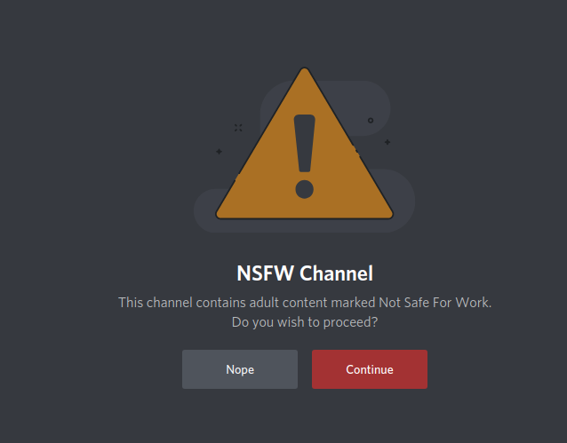  

I think this might have been a result of the invite being for the `#outhouse` channel, but I'm not sure.  I don't know 
anything about discord, but this was an odd experience  

## Messages Failing To load
At first the images failed to load, this seemed to be a result of UMatrix blocking XHR requests to 12.0.0.1 (Huh?)     
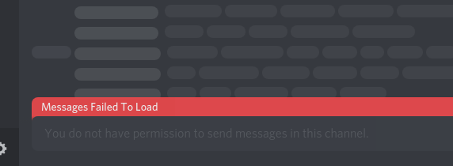  

I'd not seen this on any other website, and I'm kinda curious what is going on there.   
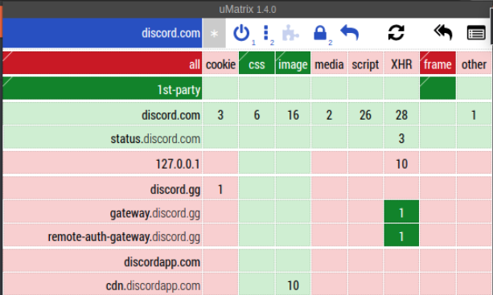  

However, allowing these requests did not get the messages to load.

---

Instead, I had to manually go to the `#rules` channel where I was greeted with a Code Of Conduct and had to add an emoji response 
to agree to it?    
The emoji response thing seems lame.  Is this a normal discord thing?      
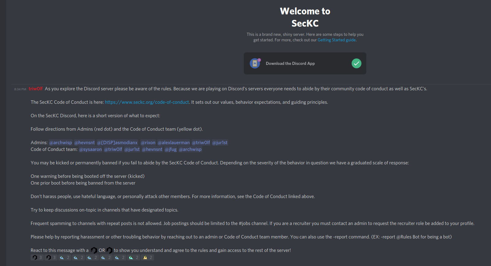

---

Having added an emoji response, I was granted access to a bunch of channels.    
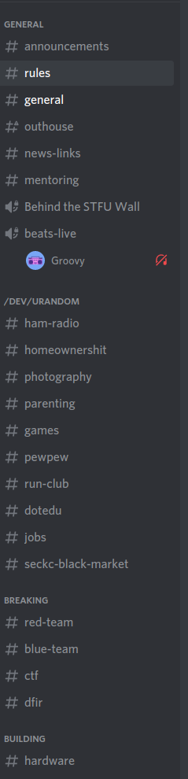  

## Sidebar
### Channel Clutter
I found that I _had_ to be in every channel, there was no option to "leave" a channel. There is an option to mute 
specific channels I didn't care about.
  
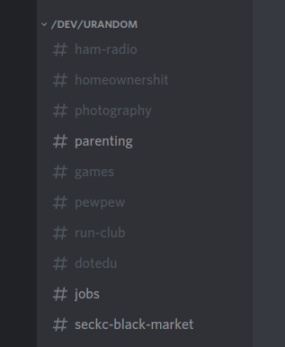

This setup was a bit annoying, where all channels are "Opt-Out", but they still clutter the sidebar.  You can mute 
entire groups of channels, but when I found I only wanted to participate in three channels out of the ten in the group, 
I had to go and mute 7 channels.  A bit annoying to setup compared to Slack's "Opt-In" channel methods.

### Hide Muted Channels
Hiding Muted Channels - Ok, i found that if you right click in an "empty" space of the sidebar, an option to "hide muted channels" appears, this helped declutter my sidebar. 

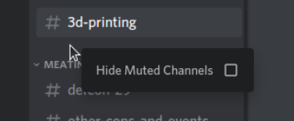

### Collapse Categories
Very useful to reduce the amount of _shown_ channels is to collapse that entire category. When messages show up from 
unmuted channels, that specific channel will appear, in bolded white, under the category, despite the category being 
collapsed.

In the below picture, you can see that the `#general` channel has shown up as a result of a new message, but the 
category is still collapsed  

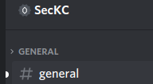

## Beeps and Boops
I found Discord to be very annoying, creating Beeps and Boops all the time and me left wondering wtf just made that 
noise.

Muting Channels and Categories helped a bunch, but it didn't solve all of them. There are more user preferences around 
notifications that will be _very_ helpful.

To access these settings, select the gear box by your username, in the lower left.   
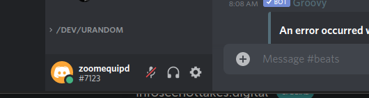

On the left menu select the "Notifications", and scroll down just a bit on the right pane to find the "Sounds" settings.  

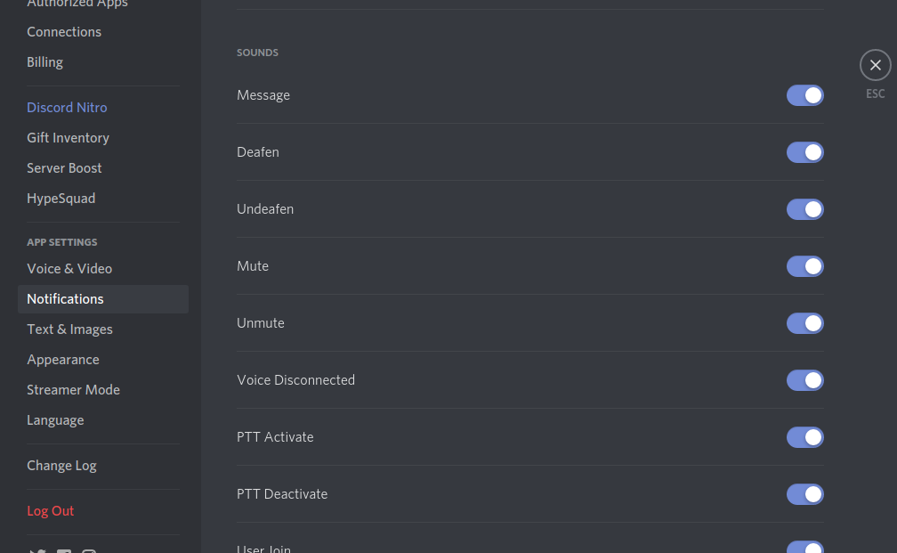

These will allow you to better configure the noises you hear. In particular, I found disabling the the "User Join/Leave"
 sounds made a large difference.

 
## Inbox
The "Inbox" in the upper right corner provides a nice way to quickly "catch up" on messages and figure out where that 
last beep just came from. 

The Inbox is the second icon from the right, in the upper right corner of the below image.  
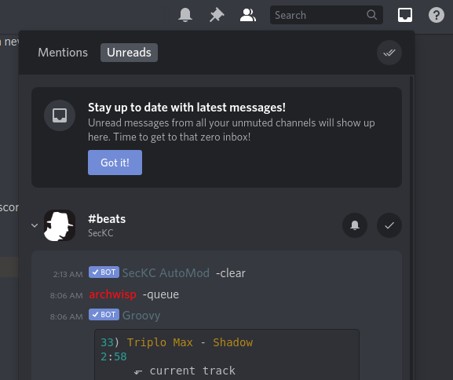

## Channels
### `beats-live`
I decided to check out the `#beats-live` channel which is supposed to allow me to listen to some music?   
I can't hear anything when I joined.   

I finally got the nerve up ot ask in the #beats channel and it turns out the music was paused or something.  Triw0lf got me squared away.  I also found [Grovy's Command Guide](https://groovy.bot/commands?category=premium&prefix=-) to be helpful. 

## Boosting
"Boosting" is a method of paying Discord and in return the server gets benefits.  Benefits include higher audio/video 
quality and vanity urls, more emojis, etc.

Boosting a server costs $4.99 a month, but is discounted if you have Nitro.

Reference: [Server Boosting](https://support.discord.com/hc/en-us/articles/360028038352-Server-Boosting-)

## Nitro
Discord Nitro, unlink the Boosting, provides _user_ specific benefits.  There are two different version of Nitro

Reference: [Discord Nitro Classic & Nitro](https://support.discord.com/hc/en-us/articles/115000435108-Discord-Nitro-Classic-Nitro)
### Discord Nitro
$9.99 a month / $99.99 a year

- 2 "free" Server Boosts plus 30% off any other Server Boosts.
- Higher Screen Sharing  (720p @ 60pfs or 1080p @ 30fps)
- "Source" video for "Go Live!" (streams)

### Discord Nitro Classic
$4.99 a month / $49.99 a year

- 30% off server boosts 
- Higher Screen Sharing  (720p @ 60pfs or 1080p @ 30fps)
- 1080p @ 60fps for "Go Live!" (streams)
- custom emojis
- other minor benefits

 
